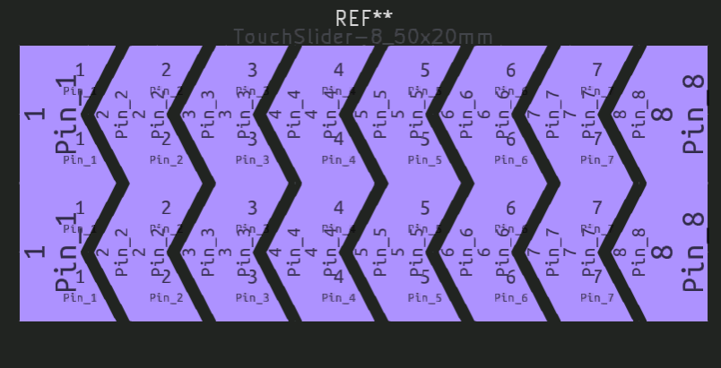
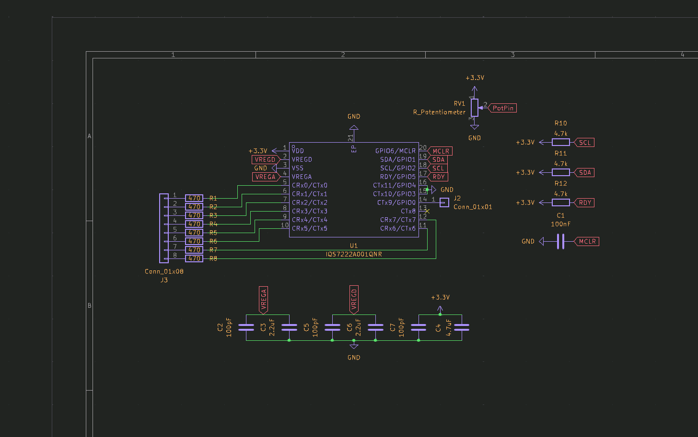

# June 9th: Mockup
To start the project, I wanted to do a mockup of the design.
I drew the idea I had in mind, which was a simple desk LED light, I also wanted it to have capacitive touch buttons to control the brightness, bc, why not?

**Total time spent: 2h**

# June 10th: Mockup
Now I had the mockup, and had to start thinking about the components I would need.
To start with, I wanted to use espHome, so I would be using an esp32, as in most of my projects.
I also wanted a way yo control the brightness, so I would need a mosfet (or led driver) to control the LEDs.
Probably a buck PSU for the esp32 will be needed too, and maybe another for the LEDs.

Components I decided to use:
- ESP32-C3-MINI-1-H4
- XLG-20-M (ACDC led driver with PWM and 0-10V dimming)
- IQS7222A001QNR (capacitive touch controller)
- JST XH connector (for the LEDs)
- RS-15-24 (24V PSU)

**Total time spent: 4h**

# June 11th: Continue searching for components and starting the schematic
Yesterday I started looking for components, and had to quit early, so I continued today.
I also thought of removing the XLG-20-M, and using 2 led drivers, warm and cold, to control the color temperature. I'd use this CWWW implementation: https://esphome.io/components/light/cwww.html
Final omponents I decided to use:
PCB1 (aluminum PCB for the LEDs):
- AL5802-7 (LED driver for the LEDs)
- GW JTLPS1.CM-JNKN-XX51-1-150-R33 (cold white LED)
- GW JTLPS1.CM-HNKK-XX510-1-150-R33 (warm white LED)
- JST XH connector (for the LEDs)
PCB2 (main PCB):
- ESP32-C3-WROOM-02-H4
- AP63203WU-7 (buck converter for the ESP32)
- IQS7222A001QNR (capacitive touch controller)
- JST XH connector (for the LEDs)
- RS-15-24 (24V PSU)
- 6100.3300 (AC C14 connector)
- [6.3mm faston terminal](https://es.aliexpress.com/item/1005007347459855.html)
- 
- SN-02C (crimp jaw for the terminals)

I also found this documentation for capacitive touch buttons: https://ww1.microchip.com/downloads/en/Appnotes/Capacitive-Touch-Sensor-Design-Guide-DS00002934-B.pdf

I started designing the schematic, started with the capacitive touch controller. For that I designed a simple footprint for the electrodes.

Final capacitive circuit:

PS: It was my first time designing a capacitive touch circuit, so I hope it works.

**Total time spent: 6h**

# June 12th: Continuing the schematic
Today I continued the schematic, more specifically the ESP32 part.
I first designed the esp32 circuit as if it was an esp32-S2, but then I realized it was an ESP32-C3, so I had to change strapping pins i used.

I also added the buck converter, and the power supply connector.

**Total time spent: 3h**

# June 13th: Finishing the schematic
Today I finished the schematic, I added the LED driver and the LEDs. I also added the connectors for the LEDs.

**Total time spent: 1.5h**

# June 14th: PCB design
Today I started the PCB design, I first designed the PCB for the capacitive touch controller (Main PCB), as it didn't seem too hard. I used 2 layers with FR4, as it was cheap and easy to work with.

After wiring everything, I finished the pcb. I'm not sure if the electrodes are too close, but I hope it works.

Then I started the PCB for the LEDs. I wanted it to be an Aluminum PCB, as it is the optimal choice for medium to high-power leds, so I think it would be a perfect fit for the LED PCB. Sadly, Aluminum PCBs are one-sided, which was complicated quite a bit the design.
I tried for hours to find a way to make it work, but I couldn't find a way to route the PCB without using vias, which is not possible with Aluminum PCBs. So I gave up for the day, and decided to try again tomorrow.
This is what I have so far: 

**Total time spent: 5h**

# June 15th: Finish PCB design
Today I finished the PCB design, I found ~~the perfect~~ a working arrangement!
It took me a while, but thanks to a new set of eyes, I finally managed to route the PCB without using vias.
I decided on using 0 ohm resistors as jumpers to create a virtual 2nd layer. IIRC, I saw this being used in a video from GreatScott, so I thought it was a good idea to try it out.

After quite a bit of work, I finally finished the PCB design!

PS: DRC gives quite a few errors bc of the jumpers, but I don't care, as they should work and I don't know how to tell kicad it's a 0-ohm jumper without modifying the schematic.

**Total time spent: 6h**

# June 16th: Start the 3d model
Today I started the 3d model, I wanted to make it simple and base it on the mockup I made at the beginning of the project.
To start with, I searched for a rigid-flexible tube I could use for the top part, as I wanted it to be adjustable. I really didn't know what to search for, so I just searched for "Flexible desk lamp tube" on aliexpress, and started hopping from one product to another until I found this one: https://es.aliexpress.com/item/1005007938186623.html The 30cm silver, Outer M10-Outer M10, seems to work for me, so I added it to the BOM.

Now that I've got all the non-printed items, I started designing the 3d model.
To start with, I designed the LED part, which is the part that will hold the LEDs and the aluminum PCB. I started with a simple cone, but switched to an octagonal prism with taper angle of 15º, as it was easier to design and looked better.

What I have so far:

