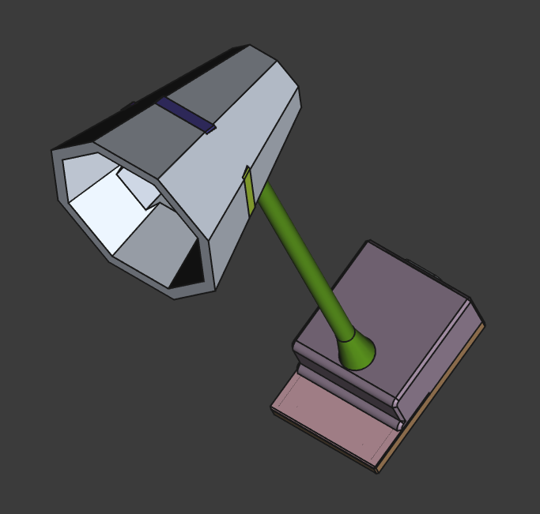

# Smart Desk Lamp
This is a home assistant controlled desk lamp with capacitive touch buttons, made with ESPHome and ESP32-C3.

## Why I made it?

I made this project as I wanted to learn more about capacitive touch sensors and how to use them with ESPHome. I also wanted to make a simple desk lamp that could be controlled with Home Assistant.

## Features

- Capacitive touch buttons to control the brightness and color temperature of the LEDs.
- Home Assistant integration.

## Images

<details>
  <summary>Case</summary>



</details>
<details>
  <summary>Schematic</summary>
  


</details>
<details>
  <summary>PCB</summary>


</details>

## BOM

| Index | Part Number                        | What the item is for in your project | Description                         | Pack Quantity | ID                                                    | Unit Price | Total Price | Total  |
| ----- | ---------------------------------- | ------------------------------------ | ----------------------------------- | ------------- | ----------------------------------------------------- | ---------- | ----------- | ------ |
| 1     | IQS7222A001QNR                     | Capacitive sensor                    | 9 CHANNEL MUTUAL / 8 SELF-CAPAC     | 2             | 1790-IQS7222A001QNRCT-ND                              | 0.82       | 1.64        | 149.36 |
| 2     | ESP32-C3-WROOM-02-H4               | MCU                                  | RF TXRX MOD BT WIFI PCB TH SMD      | 1             | 1965-ESP32-C3-WROOM-02-H4CT-ND                        | 3.51       | 3.51        |        |
| 3     | IRM-20-24                          | PSU                                  | AC/DC CONVERTER 24V 22W             | 1             | 1866-3040-ND                                          | 9.20       | 9.20        |        |
| 4     | AP63203WU-7                        | 3.3V buck                            | IC REG BUCK 3.3V 2A TSOT23-6        | 2             | AP63203WU-7DICT-ND                                    | 0.71       | 1.42        |        |
| 5     | AL5802-7                           | Led driver                           | IC LED DRVR LIN PWM 120MA SOT26     | 5             | AL5802-7DICT-ND                                       | 0.23       | 1.15        |        |
| 6     | 2N7002                             | mosfet to drive the led drivers      | MOSFET N-CH 60V 280MA SOT23-3       | 3             | 4878-2N7002CT-ND                                      | 0.12       | 0.36        |        |
| 7     | GW JTLPS1.CM-HNKK-XX510-1-150-R33  | 2200K led                            | LED DURIS E2835 WHT 2200K 2835      | 10            | 475-GWJTLPS1.CM-HNKK-XX510-1-150-R33CT-ND             | 0.067      | 0.67        |        |
| 8     | GW JTLPS1.CM-JNKN-XX51-1-150-R33   | 6500K led                            | LED DURIS E2835 WHITE 6500K 2835    | 10            | 475-GWJTLPS1.CM-JNKN-XX51-1-150-R33CT-ND              | 0.067      | 0.67        |        |
| 9     | SRR5018-3R9Y                       | inductor                             | FIXED IND 3.9UH 2A 55 MOHM SMD      | 2             | 118-SRR5018-3R9YCT-ND                                 | 0.64       | 1.28        |        |
| 10    | 12mm LED Gooseneck                 | 12mm LED Gooseneck                   | 30 cm silver, Outer M10 – Outer M10 | 1             | https://es.aliexpress.com/item/1005007938186623.html  | 11.50      | 11.50       |        |
| 11    | 703W-00/53                         | Power Connector                      | PWR ENT RCPT IEC320-C14 PNL SLDR    | 1             | Q219-ND                                               | 1.54       | 1.54        |        |
| 12    | MF72-005D7                         | Inrush current limiter               | ICL 5 Ω 20% 2A 9 mm                 | 2             | 317-1148-ND                                           | 0.43       | 0.86        |        |
| 13    | M3x30 mm 4762                      | M3x30 mm 4762                        | M3x30 mm 4762                       | 1             | https://www.aliexpress.com/item/1005006453614010.html | 3.105      | 3.105       |        |
| 14    | M10 nut                            | M10 nut                              | M10 nut                             | 1             | https://www.aliexpress.com/item/1005007593861199.html | 3.0935     | 3.0935      |        |
| 15    | Soldering iron heatset insert tips | Soldering iron heatset insert tips   | Soldering iron heatset insert tips  | 1             | https://www.aliexpress.com/item/1005008493831823.html | 21.3785    | 21.3785     |        |
| 16    | M3x6 mm 4762                       | M3x6 mm 4762                         | M3x6 mm 4762                        | 1             | https://www.aliexpress.com/item/1005006453614010.html | 2.139      | 2.139       |        |
| 17    | Wood Filament                      | Wood Filament                        | Wood Filament                       | 1             | https://www.aliexpress.com/item/1005006685394618.html | 38.1685    | 38.1685     |        |
| 18    | 30 cm JST XH 4P                    | 30 cm JST XH 4P                      | 30 cm JST XH 4P                     | 1             | https://www.aliexpress.com/item/1005008319201640.html | 2.5645     | 2.5645      |        |
| 19    | CL10A104KA8NNNC                    | Passive                              | CAP CER 0.1 µF 25 V X5R 0603        | 10            | 1276-1857-1-ND                                        | 0.028      | 0.28        |        |
| 20    | CL10A475KQ8NNNC                    | Passive                              | CAP CER 4.7 µF 6.3 V X5R 0603       | 10            | 1276-1045-1-ND                                        | 0.008      | 0.08        |        |
| 21    | CL10A225KQ8NNNC                    | Passive                              | CAP CER 2.2 µF 6.3 V X5R 0603       | 10            | 1276-1183-1-ND                                        | 0.032      | 0.32        |        |
| 22    | CL10A226MQ8NRNC                    | Passive                              | CAP CER 22 µF 6.3 V X5R 0603        | 5             | 1276-1193-1-ND                                        | 0.22       | 1.10        |        |
| 23    | CL10A104KA8NNNC                    | Passive                              | CAP CER 0.1 µF 25 V X5R 0603        | 10            | 1276-1857-1-ND                                        | 0.028      | 0.28        |        |
| 24    | CL05C101JB5NNNC                    | Passive                              | CAP CER 100 pF 50 V C0G/NP0 0402    | 10            | 1276-1025-1-ND                                        | 0.003      | 0.03        |        |
| 25    | 61300411121                        | Passive                              | CONN HEADER VERT 4POS 2.54 mm       | 2             | 732-5317-ND                                           | 0.17       | 0.34        |        |
| 26    | CRCW0603470MJPEAHR                 | Passive                              | RES SMD 470 MΩ 5% 1/10 W 0603       | 10            | 541-470MAHCT-ND                                       | 0.151      | 1.51        |        |
| 27    | RC0603FR-074K7L                    | Passive                              | RES 4.7 KΩ 1% 1/10 W 0603           | 10            | 311-4.70KHRCT-ND                                      | 0.009      | 0.09        |        |
| 28    | RC0603FR-071KL                     | Passive                              | RES 1 KΩ 1% 1/10 W 0603             | 10            | 311-1.00KHRCT-ND                                      | 0.009      | 0.09        |        |
| 29    | RC0603FR-0710KL                    | Passive                              | RES 10 KΩ 1% 1/10 W 0603            | 10            | 311-10.0KHRCT-ND                                      | 0.009      | 0.09        |        |
| 30    | PTS815SJM250SMTRLFS                | Esp32 buttons                        | SWITCH TACTILE SPST-NO 0.05 A 12 V  | 4             | CKN12215-1-ND                                         | 0.22       | 0.88        |        |
| 31    | PCB                                | PCB                                  | PCB                                 | 1             | https://aisler.net                                    | 40.02      | 40.02       |        |

## Configuration

Remember to set your secrets in [secrets.yaml](Code/secrets.example.yaml).

All firmware configuration lives in [code.yaml](Code/code.yaml):
PS: This configuration is for reference only, The final configuration will be for the ESP32-S2. You'll also have to configure the devices you want to control in Home Assistant.

```yaml
esphome:
  name: controlpad
  friendly_name: ControlPad

esp32:
  board: esp32-c3-devkitm-1
  framework:
    type: arduino

# Enable logging
logger:

# Enable Home Assistant API
api:
  encryption:
    key: !secret api_key

ota:
  - platform: esphome
    password: !secret ota_password

wifi:
  ssid: !secret wifi_ssid
  password: !secret wifi_password

  # Enable fallback hotspot (captive portal) in case wifi connection fails
  ap:
    ssid: "Controlpad Fallback Hotspot"
    password: "wHjqyQOLnaPa"

globals:
  - id: page_active
    type: int
    initial_value: "0"

i2c:
  sda: GPIO6
  scl: GPIO7
  frequency: 800kHz
  scan: true

binary_sensor:
  - platform: gpio
    pin:
      number: GPIO2
      mode: INPUT_PULLUP
      inverted: true
    name: "Button1"
    on_press:
      - display.page.show: page1
      - lambda: |-
          id(page_active) = 1;

  - platform: gpio
    pin:
      number: GPIO4
      mode: INPUT_PULLUP
      inverted: true
    name: "Button2"
    on_press:
      - display.page.show: page2
      - lambda: |-
          id(page_active) = 2;

  - platform: gpio
    pin:
      number: GPIO21
      mode: INPUT_PULLUP
      inverted: true
    name: "toggle1"
    on_press:
      then:
        - if:
            condition:
              lambda: |-
                return id(page_active) == 1;
            then:
              - homeassistant.service:
                  service: light.toggle
                  data:
                    entity_id: light.led_controller_1_light_bar

sensor:
  - platform: homeassistant
    name: "Bar Light Brightness"
    id: led_controller_1_light_bar_brightness
    entity_id: light.led_controller_1_light_bar
    attribute: brightness
    unit_of_measurement: "%"
    filters:
      - lambda: |-
          if (isnan(x)) return 0.0f;
          return int(x * 100.0f / 255.0f);

  - platform: adc
    pin: GPIO3
    name: "potentiometer1"
    id: potentiometer1
    attenuation: 12db # allow 0–3.3 V range
    update_interval: 20ms
    unit_of_measurement: "%"
    filters:
      - sliding_window_moving_average:
          window_size: 10
          send_every: 5
      - lambda: |-
          if (isnan(x)) return 0.0f;
          int pot_val = int(x * 100.0f / 2.9f);
          if (pot_val > 100) pot_val = 100;
          return pot_val;
      - delta: 1.0

    on_value:
      then:
        - if:
            condition:
              lambda: |-
                return id(page_active) == 1;
            then:
              - homeassistant.service:
                  service: light.turn_on
                  data:
                    entity_id: light.led_controller_1_light_bar
                    brightness_pct: !lambda "return (int)x;"

# SH1106 128×64 over I2C
display:
  - platform: ssd1306_i2c
    model: SH1106 128x64
    id: display1
    address: 0x3C
    rotation: 0
    update_interval: 100ms
    pages:
      - id: page1
        lambda: |-
          int val1 = int((id(led_controller_1_light_bar_brightness).state / 100.0f) * 31);
          if (val1 != 0) {
            val1 += 1;
          }
          it.filled_rectangle(10, 64-val1, 5, 33);

          // it.printf(0, 0, id(font1), "%.0f%%", id(led_controller_1_light_bar_brightness).state);
      - id: page2
        lambda: |-
          it.print(0, 10, id(font1), "This is page 2!");
          it.filled_rectangle(10, 20, 80, 5);

font:
  - file: "gfonts://Ubuntu"
    id: font1
    size: 20

captive_portal:
```
